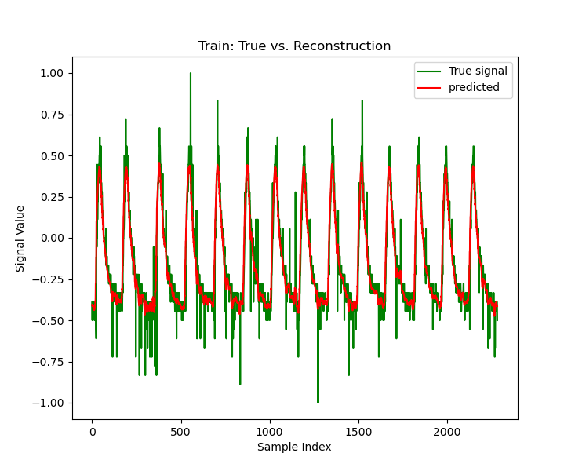
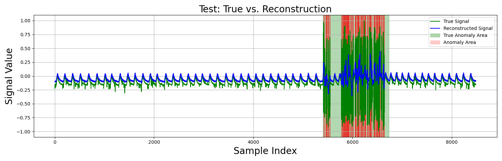
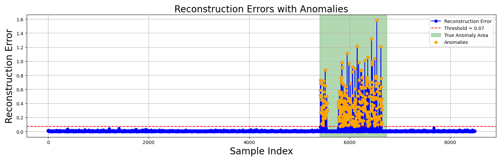

# Spacecraft Anomaly Detection

Unsupervised anomaly detection in spacecraft telemetry with an LSTM autoencoder.
The model learns to reconstruct normal signal behaviour. Samples it cannot reconstruct
well, measured by the reconstruction error, are flagged as anomalies.

This was a semester project in a university deep learning lab course (winter term
2024/25), carried out in a team of two. The results were presented as a scientific
poster, which is not part of this repository.

## Overview

- **Data:** NASA SMAP and MSL telemetry data set (Soil Moisture Active Passive satellite
  and Mars Science Laboratory rover). Each channel is one time series with a training
  part without labelled anomalies and a test part with labelled anomaly sequences.
- **Input pipeline:** `tf.data` pipeline that cuts a telemetry channel into sliding
  windows (default: 8 samples, shifted by 2). The last 20 % of the training signal are
  used for validation. Optional augmentation with noise, time shift and scaling.
- **Model:** LSTM autoencoder. The encoder (LSTM layers with 128 and 64 units) compresses
  a window into one vector, the decoder (64 and 128 units) reconstructs the window from it.
- **Training:** custom training loop with Adam and mean squared error, trained only on
  the anomaly-free training signal.
- **Detection:** a sample is marked as an anomaly if its reconstruction error exceeds a
  fixed threshold. The detections are compared with the labelled anomaly sequences
  (confusion matrix, accuracy, balanced accuracy, F1 score).
- **Experiment tracking:** [Weights & Biases](https://wandb.ai).
- **Configuration:** all parameters are set in one file with [Gin](https://github.com/google/gin-config).

## Results

A separate model was trained for each telemetry channel. The table shows the
best-performing channels out of the 82 channels in the data set. These signals are
more or less periodic, except D-14, which is a constant signal.

| Channel | Train loss | Val. loss | Reconstruction error | Accuracy | F1 score | Anomalies detected |
|---|---|---|---|---|---|---|
| A-3 | 0.022 | 0.016 | 0.018 | 0.97 | 0.11 | 1/1 |
| D-1 | 0.003 | 0.002 | 0.020 | 0.66 | 0.019 | 1/1 |
| D-14 | 2e-7 | 2e-7 | 0.027 | 0.98 | 0.93 | 2/2 |
| E-2 | 0.005 | 0.004 | 0.008 | 0.84 | 0.032 | 1/1 |
| P-3 | 0.011 | 0.008 | 0.019 | 0.90 | 0.50 | 1/1 |

*Anomalies detected* counts the labelled anomaly sequences in which at least part of
the sequence was found. Accuracy and F1 score are computed per sample.

Findings:

- The approach locates every labelled anomaly sequence in these channels, but not every
  single sample inside a sequence is flagged. This is why the per-sample F1 scores are
  low for most channels even though the anomalies are found.
- The signals differ strongly in type and shape, so each channel needs its own model
  and its own parameters. Small changes to window size, window shift and batch size
  have a large effect. The window size ranges from 8 samples for P-3 to about 100 for A-3.
- Sliding windows that overlap are needed to get enough training data and reasonable results.
- The augmentation methods that were tried did not improve the performance.

The figures below show channel P-3.

### Reconstruction of the training signal

The autoencoder follows the periodic shape of the signal and smooths out individual spikes.



### Test signal

On the test signal, the reconstruction stays close to the true signal in the normal
sections. Inside the labelled anomaly (green area) the signal behaves differently and
the model can no longer reconstruct it. Detected anomalies are marked in red.



### Reconstruction error

The reconstruction error stays near zero for normal samples and rises clearly above the
threshold inside the labelled anomaly. Many samples in the anomaly are detected
correctly, but not all of them, in particular in the first part where the error remains low.



## Project structure

```
spacecraft_anomaly_detection/
├── configs/config.gin              all parameters
├── input_pipeline/
│   ├── datasets.py                 loading, windowing, tf.data pipeline
│   └── preprocessing.py            augmentation
├── models/
│   └── architectures.py            LSTM autoencoder
├── evaluation/
│   ├── metrics.py                  loss tracking
│   └── eval.py                     reconstruction error, thresholding, metrics, plots
├── utils/                          run folders, logging, W&B setup
├── train.py                        training loop
└── main.py                         entry point for training and evaluation
```

## Setup

The project was developed with Python 3.9 and TensorFlow 2.10.

```
pip install -r requirements.txt
```

Download the SMAP and MSL data (see [telemanom](https://github.com/khundman/telemanom))
and arrange it like this:

```
<data_dir>/NASA/
├── train/                    A-1.npy, P-3.npy ...
├── test/
└── labeled_anomalies.csv
```

Then set `load.data_dir` in `configs/config.gin` to your `<data_dir>`.

## Usage

```
python main.py                                    # train, then evaluate
python main.py --run <path-to-run-folder>         # continue training from a checkpoint
python main.py --notrain --run <path-to-run-folder>   # evaluate only
```

Each run writes its checkpoints, logs and a copy of the configuration to a folder
`experiments/run_<timestamp>`, located next to the project folder.

### Weights & Biases

By default, runs are logged offline. To synchronise them, set your own values in
`configs/config.gin`:

```
wandb_init.project = "your-project"
wandb_init.entity = "your-entity"
wandb_init.key = "xxx"
```

Do not commit your API key. Passing it on the command line with `--wandb <your-api-key>`
keeps it out of the repository.

### Changing the configuration

| What | Parameters in `configs/config.gin` |
|---|---|
| Telemetry channel | `load.ts_name = "E-2"` (`"all"` loads every channel) |
| Window size | `LSTM_Autoencoder.time_steps`, `plot_result.win_size`, `load.win_size` |
| Window shift | `plot_result.win_offset`, `load.win_offset` |
| Detection threshold | `detect_anomalies.threshold` |

The three window size parameters must always have the same value, and so must the two
window shift parameters. A shift equal to the window size means no overlap.

## Data

The data set is not part of this repository. It was published with:

> K. Hundman et al., "Detecting Spacecraft Anomalies Using LSTMs and Nonparametric
> Dynamic Thresholding", *KDD*, 2018.
